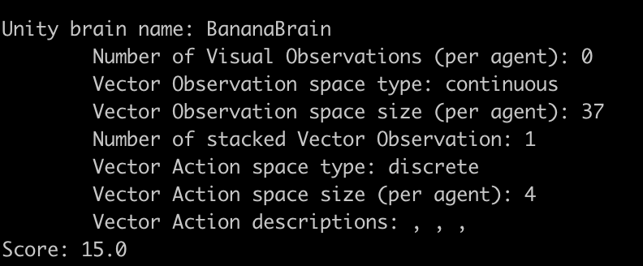

# Navigation

### 0. Report

Check the file [Report](https://github.com/WilliamGalindezArias/p1_navigation/blob/master/report.md) on this repository to learn the Model architecture and output

### 1. Environment

The simulation contains a single agent that navigates a large environment.  At each time step, it has four actions at its disposal:
- `0` - walk forward 
- `1` - walk backward
- `2` - turn left
- `3` - turn right

The state space has `37` dimensions and contains the agent's velocity, along with ray-based perception of objects around agent's forward direction.  A reward of `+1` is provided for collecting a yellow banana, and a reward of `-1` is provided for collecting a blue banana. 

The environment is considered solved once it reaches an average score >= 16, as it can be seen in the `dqn` function:

```
np.mean(scores_window)>=16
print('\nEnvironment solved in {:d} episodes!\tAverage Score: {:.2f}'.format(i_episode-100, np.mean(scores_window)))
````

### 2. Running the Agent

2.0 Download the project [environment](https://github.com/udacity/deep-reinforcement-learning/tree/master/p1_navigation#getting-started)

2.1 Install [Unity](https://github.com/Unity-Technologies/ml-agents/blob/main/docs/Installation.md)  

2.1 Run `pip install -r requirements.txt ` 

2.2 Run `python navigation.py` on your console. You should get an output like this one:  



### 3. Trained Agent in Unity Environment 

Agent trained [video](https://youtu.be/i6OgvD38fHs)
