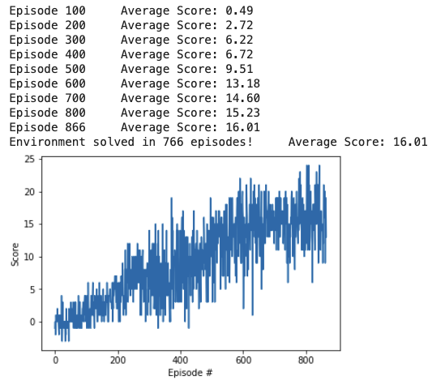

## Navigation - Project 1

### Agent - Model

The agent that interacts and learned from the environment uses a `QNetwork`that inherits from torch `nn.Module`  

The parameters of the model are:  
- state_size
- action_size
- Neural Network layers:<br>  

  |(state_size)(37)| -> |(fc1_units)(64)| -> |(fc2_units)(64)| -> |(actions_size)(4)|
  
  Where 64 are the node units in fc1 and fc2 (hidden layers)
  
- Relu activation function 

The *forward pass* in the Neural Network maps *state* to *action values*


### Learning algorithm 

The algorithm learns from the interaction with the environment and by having a well defined reward, in this case a `+1` every time it collects a yellow banana and a penalty of `-1` when it collects the non-yellow ones.  
Every action the agent takes in its interaction with the environment presents to it a new set of observations and reward calculated. The QNetwork in the Agent class is in charge of taking each state vector presented to it and map it or approximate it to a certain action value using Neural Networks, actions which in turn  will be selected using an `epsilon-greedy` policy. The actions taken will affect again the environment providing a new set of observations that will allow us to calculate the *Q-values* and compute its loss, therefore enabling the agent to learn updating the expected reward for each action taken.  
The implementation in this project also leverages ReplayBuffer, technique which allows to remove correlations obtained given the nature of  sequential data. Within the ReplayBuffer we use experience replay to sample experience tuples and learn from rare ocurrences while interacting with the environment

# Artifacts

1. [Notebook](https://gitlab.com/r-learning/navigation/-/blob/master/01-navigation-wg-delivered.ipynb) with solution
2. Script to run the environment outside jupyter-notebook `navigation.py`(https://gitlab.com/r-learning/navigation/-/blob/master/navigation.py)
3. Weights `checkpoint.pth` of trained model in root folder [Navigation](https://gitlab.com/r-learning/navigation)

#### Agent parameters

```
BUFFER_SIZE = int(1e5)  # replay buffer size  
BATCH_SIZE = 64         # minibatch size
GAMMA = 0.99            # discount factor
TAU = 1e-3              # for soft update of target parameters
LR = 5e-4               # learning rate 
UPDATE_EVERY = 10        # how often to update the network
```

The value `UPDATE_EVERY` was set to 10 to improve the learning in the algorithm. With values < 10 the average score had considerable deviations.

#### Learning

The Environment is solved once it gets a `score > 15` after `866` episodes


#### Improvements

The agent can be improved by reading pixels, and implementing Double-Q learning, which has been proved to be helpful in noise environments that slow the learning.
